# SubQ-1.1-Small 技術報告（中文全文翻譯）

> **原文標題：** SubQ-1.1-Small Technical Report  
> **作者：** Saul Ramirez∗, Alex Whedon∗, Ashmal Vayani, Phong Vo — Subquadratic AI  
> *∗ 同等貢獻*  
> **翻譯日期：** 2026-06-19  
> **翻譯說明：** 本文件為 SubQ-1.1-Small 技術報告的完整中文翻譯，保留原文結構、圖表與表格。圖片已從原始 PDF 提取並嵌入。

---

## 摘要（Abstract）

許多高價值的 AI 工作負載需要對完整工件（artifacts）進行推理——包括整個程式碼倉庫、文件集合和知識庫——而非孤立的片段。目前大多數系統並非直接對這些工件進行推理。它們依賴檢索管道（retrieval pipelines）、分塊策略（chunking strategies）和代理編排（agentic orchestration），將資訊分解成片段並在推理時重新組合。這些方法通常有效，但它們之所以存在，很大程度上是因為密集注意力（dense attention）的計算量與上下文長度呈二次方增長，使得隨著上下文窗口的擴大，直接對大型工件進行推理變得越來越昂貴。因此，現代 AI 堆疊的很大一部分是圍繞**上下文稀缺性**來設計的，而非直接對完整工件進行推理。

我們提出 **SubQ-1.1-Small**，一個建立在**次平方稀疏注意力（Subquadratic Sparse Attention，SSA）**之上的長上下文語言模型。SSA 是一種內容相關的稀疏注意力機制，具有線性的計算和記憶體成本。相較於密集注意力，SSA 在 1M token 上下文窗口下將注意力 FLOPs 降低了 **64.5 倍**。這種降低不僅使長上下文推理更便宜，也使開發過程中的長上下文訓練變得實用——我們得以執行超過一百次長上下文實驗，**搜索**訓練配方而非猜測。

這一實驗制度產生了本工作的核心結果：**長上下文檢索能力遠遠泛化到訓練窗口之外**。主要在 1M tokens 上訓練，並在 2M 上進行額外訓練的 SubQ-1.1-Small，在 13 項任務的 RULER 基準上達到 **99.12%**，在 2M tokens 上保持 **100%** 的單針檢索準確率，並在 **12M tokens** 上維持 **98%** 的檢索準確率——約超出其主要訓練窗口一個數量級——同時僅關注 **0.13%** 的 token 對，接近 **1000 倍**的減少。除了檢索之外，SubQ-1.1-Small 在 AutomationBench Finance（一個長時域代理基準）上接近前沿水平，提供了早期證據表明相同的長上下文訓練制度可以轉移到長時域推理。

綜合來看，這些結果表明高效注意力之所以重要，不僅因為它降低了推理成本，更因為它使**完整工件推理所需的長上下文訓練實驗變得可行**。

---

## 1. 引言（Introduction）

### 1.1 為什麼長上下文很重要

大型語言模型已從研究系統迅速進入生產環境。它們編寫和審查程式碼、分析文件、回答技術材料的問題，並且越來越多地充當執行多步驟工作的代理（agents）。它們今天最可靠的地方，是那些能舒適地放入模型上下文窗口內的任務。最具挑戰性的問題通常具有不同的結構：它們需要對**完整工件**進行推理，而非工件的片段。

- 一份法律協議可能在第 2 頁定義一個術語，在第 12 頁對其進行限定，在第 46 頁添加例外條款，並在附表中再次修訂。
- 一個函數可能在一個檔案中定義，從四十個其他地方被呼叫，被間接測試，並受到編碼在架構中而非註釋中的不變量約束。
- 一個研究問題可能需要調和數十篇論文，其術語重疊但論點分歧；一次財務審查可能需要連接申報文件、收益報告、合約和內部記錄。

在這些情況下，任務不僅僅是檢索一個相關段落。它是要對分佈在整個大型工件中的**關係進行推理**。

我們在本報告中將這些稱為**完整工件推理任務（whole-artifact reasoning tasks）**：其結構要求跨完整工件進行推理，而非跨孤立片段。隨著模型越來越多地應用於軟體倉庫、文件集合、知識庫和其他大型語料庫，執行完整工件推理的能力變得越來越重要。

### 1.2 圍繞上下文稀缺性的建構

儘管完整工件推理的重要性日益增長，大多數 AI 系統並不直接對完整工件進行推理。相反，它們依賴檢索管道（retrieval pipelines）、分塊策略（chunking strategies）、摘要和代理工作流，將資訊分割成較小的上下文，並在推理時重建相關片段。它們的普遍性反映了根本的計算約束：直接對大型工件進行推理仍然昂貴，因為密集注意力的計算量與上下文長度呈二次方增長。

從這個角度來看，現代 AI 堆疊的很大一部分可以理解為圍繞**上下文稀缺性**構建的支架（scaffolding）。資訊在被推理之前被分割、檢索、摘要、路由和重建。由此產生的系統經常將學習模型與大量外部指定的資訊路由和任務分解相結合。

這種模式與 Sutton 的「苦澀的教訓」（The Bitter Lesson）[35] 相似。在 AI 的歷史中，研究人員反覆引入越來越複雜的機制來彌補當代模型的限制，但當更大規模的學習和計算變得可行時，這些機制就被取代了。手工設計的特徵讓位給學習表示。特定任務的管道讓位給端到端訓練。在每種情況下，大部分表面上的複雜性反映了底層學習系統的限制，而非任務本身的結構。

現代的檢索和編排系統可能代表類似的現象。注意力本身已經是一種用於資訊路由和檢索的**學習機制**。然而，因為對完整工件應用注意力仍然過於昂貴，現代 AI 系統經常依賴額外的支架來確定模型看到什麼資訊以及何時看到。它們的廣泛採用可能同樣反映了當前注意力制度的約束，而非底層任務的基本要求。

高效的長上下文架構提供了測試這種可能性的機會。當對完整工件進行推理在計算上變得可行時，某些形式的支架可能被證明是必需的，而其他形式可能隨著更多的資訊選擇問題被學習計算所吸收而逐漸消失。

### 1.3 SubQ-1.1-Small

我們推出 **SubQ-1.1-Small**，一個建立在次平方稀疏注意力（Subquadratic Sparse Attention，SSA）之上的長上下文語言模型。SSA 是一種內容相關的稀疏注意力機制，在計算和記憶體方面均隨序列長度**線性**擴展。我們在最高達 200 萬 tokens 的上下文長度上訓練了 SubQ-1.1-Small，並觀察到遠遠超出訓練窗口的強大檢索性能，延伸至最高 1200 萬 tokens 的探索性評估。200 萬 token 的訓練限制反映了訓練計劃的範圍，而非 SSA 本身的限制——SSA 此前已被用於在最高 1200 萬 tokens 的序列上進行訓練。

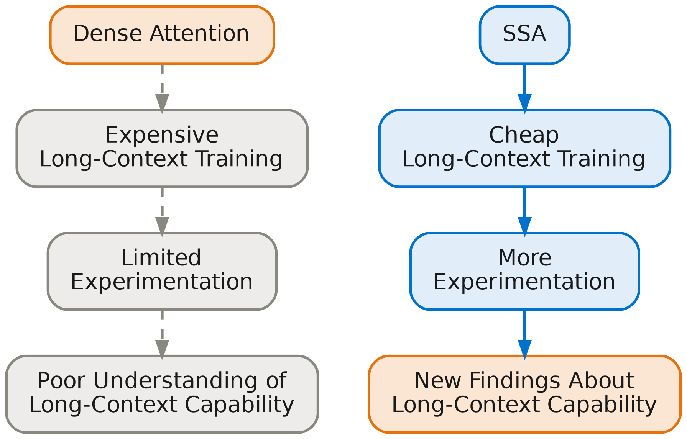

> **圖 1：** 注意力制度與實驗之間的關係。密集注意力使長上下文訓練變得昂貴，限制了可執行的實驗數量和規模。SSA 降低了這些成本，實現了更廣泛的實驗和本工作的發現。

SSA 還使長上下文訓練大幅降價。這不僅對部署有意義，也對研究有意義。圖 1 說明了這種關係。密集注意力使長上下文訓練昂貴，限制了可執行的實驗規模和數量。通過降低這些成本，SSA 擴大了研究人員能夠負擔探索的空間。

利用這種效率，我們在百萬級和多百萬級 token 規模上進行了廣泛的長上下文訓練和評估調查。這些實驗檢驗了訓練上下文長度、持續預訓練、檢索性能和上下文長度泛化之間的關係。貫穿這項研究，我們發現強勁的長上下文能力可以從相對較小的模型中浮現——當以大規模高效訓練時。

---

## 2. 背景（Background）

注意力的二次方成本激發了多年來對更高效替代方案的研究。提出的解決方案涵蓋稀疏注意力（sparse attention）、線性注意力（linear attention）、狀態空間模型（state-space models）和混合架構（hybrid architectures），每種方案通過不同的機制降低序列處理的成本。儘管取得了實質性進展，密集注意力仍然是前沿模型中的主導架構，而大多數出現在生產中的高效替代方案則保留了一些密集注意力組件以保留純方案所損失的能力。

本節其餘部分檢視這些方法以及阻止高效序列模型同時實現高效縮放、內容相關檢索和強長上下文能力的具體權衡。圖 2 繪製了接下來的各個家族，並顯示了 SSA 在其中的位置。

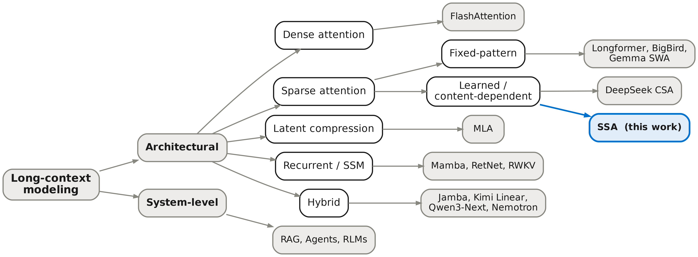

> **圖 2：** 長上下文建模方法的分類法。架構方法改變模型本身如何處理序列；系統級方法保持模型不變，並圍繞其上下文限制進行編排。SSA 是一種學習的、內容相關的稀疏注意力方法，安置在最接近的已發表比較點旁邊。

### 2.1 Flash Attention

Flash Attention [7; 5] 是過去幾年中關於注意力效率最重要的研究工作，並且**不是本文中任何內容的競爭對手**。它是密集注意力當前的標準實現，我們在整篇報告中將其用作密集注意力基線。

Flash Attention 的貢獻在於 GPU 核心層面，而非數學公式。標準注意力若天真地計算，會在 GPU 記憶體中實體化完整的 n×n 注意力矩陣——這一成本在計算成本之前就變得難以承受，因為 GPU 高頻寬記憶體與片上 SRAM 之間的記憶體頻寬是吞吐量的瓶頸約束。Flash Attention 重新排序計算，使注意力矩陣從未被完全實體化：它將計算分割成適合 SRAM 的區塊，在過程中維護運行中的 softmax 統計數據，並僅將最終輸出寫回高頻寬記憶體。注意力所需的峰值記憶體從 O(n²) 降至 O(n)，吞吐量大幅上升。輸出在數值上與天真公式完全相同。

Flash Attention **沒有改變**的是注意力的漸近計算成本。浮點運算的數量仍然是 O(n²)，儘管這些運算以更高的記憶體效率執行。將序列長度加倍仍然使所需的注意力計算量**增加四倍**，而主導百萬級 token 工作負載的二次方縮放保持不變（圖 3）。Flash Attention 解決了使密集注意力在長上下文長度上不切實際的記憶體問題；它沒有解決最終限制密集注意力能擴展多遠的**計算問題**。這樣做使更長上下文的實驗首次變得可行，但它沒有移除最終限制實驗能延伸多遠的縮放障礙。

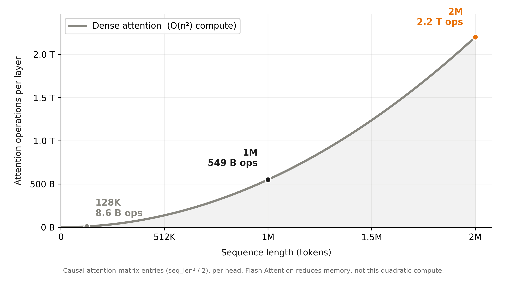

> **圖 3：** 密集注意力每層的運算量作為序列長度的函數，顯示在 SubQ-1.1-Small 的運行範圍內。在 128K tokens（許多系統仍視為長上下文的長度），注意力每層僅需 86 億次運算；在 1M 為 5490 億次；在 2M 為 2.2 兆次——上下文加倍導致計算量增加四倍。Flash Attention 保留了這種計算的二次方增長，即使減少了記憶體佔用。

### 2.2 稀疏注意力（Sparse Attention）

因此，稀疏注意力是對注意力二次方成本最直接的架構回應。如果只有一小部分 token 互動對輸出有意義地貢獻 [4; 3]，模型應該能夠僅計算這些互動並避免其餘部分。在實踐中，挑戰從來不是稀疏性本身。挑戰一直是**決定保留哪些互動**。

大多數稀疏注意力系統通過**固定模式**做出該決定。滑動窗口注意力 [2]、步進注意力 [3] 和相關方法根據位置而非內容限制注意力。這些方法實現了良好的縮放屬性，且在實踐中仍然有用——滑動窗口注意力在 Gemma [12] 等生產模型中出貨——但它們犧牲了使密集注意力有效的**內容相關路由**行為。一個 token 只能在模式允許的地方關注，無論相關資訊是否真的在那裡。

其他方法試圖通過壓縮而非遮罩來保留能力。多頭潛在注意力（Multi-head Latent Attention，MLA）[9] 等方法將鍵和值壓縮為學習的潛在表示，大幅減少了瓶頸自回歸推理的 KV 快取記憶體和頻寬，並已在前沿系統中得到採用。MLA 最好被理解為解決與 SSA 不同的問題：它解決的是推理時的記憶體效率，而非預填充注意力計算的成本。攝取長上下文時執行的二次方工作保持不變，因此 MLA 本身不會改變長上下文訓練的經濟學。

高效注意力研究中反覆出現的挑戰不是**獲得稀疏性**。而是在保持計算效率的同時**保留內容相關檢索**。現有方法通常在這個權衡的一側成功，但不是兩側都成功：它們要麼通過限制資訊流動的位置實現良好的縮放，要麼保留靈活性同時保留大量的二次方計算。

最終，固定模式的稀疏注意力機制在 RULER 等長上下文檢索基準上失敗了。核心問題仍未解決：如何在**不犧牲長上下文推理所依賴的檢索行為**的情況下獲得高效縮放。

### 2.3 學習的稀疏注意力（Learned Sparse Attention）

學習的稀疏注意力已成為將 Transformer 模型擴展到越來越長上下文的密集注意力的有前景替代方案。學習的稀疏方法不是要求每個查詢 token 關注整個序列，而是嘗試識別並僅訪問上下文中**最相關**的部分，在保留對重要資訊的存取的同時降低計算成本。與依賴固定模式或手工路由規則的傳統稀疏注意力方法不同，學習的稀疏方法直接從數據中確定注意力應分配的位置，使稀疏模式能夠適應序列本身的內容。

一個突出的例子是 **Native Sparse Attention（NSA）**，也稱為 DeepSeek Sparse Attention，由 DeepSeek-AI [10] 引入。NSA 用一個稱為**Lightning Indexer**的學習路由機制取代固定稀疏模式，該機制預測序列的哪些部分應接收注意力。這代表了長上下文架構設計的一個重要轉變。路由決策本身是學習的，而非手動指定資訊應如何流經模型，使注意力分配能夠動態適應序列的內容。然而，Lightning Indexer 是一個仍使用**完全注意力**的蒸餾 Transformer，它**沒有避免二次方計算複雜度問題**，最終在大約 52,000 tokens 處超過教師模型稀疏注意力的計算量。

DeepSeek V4 [11] 通過結合學習的稀疏檢索與壓縮記憶體表示的混合長上下文架構擴展了這一範式。其**壓縮稀疏注意力（Compressed Sparse Attention，CSA）** 機制以與 NSA 相同的方式應用學習的檢索，但在序列的**壓縮表示**上進行。通過在壓縮記憶體而非原始 token 流上執行檢索，CSA 減少了必須搜索的資訊量，同時保留對長程上下文的內容相關訪問。然而，其 Lightning Indexer 仍然具有二次方計算複雜度，隨著輸入增長而主導計算量。

該架構還引入了**重度壓縮注意力（Heavily Compressed Attention，HCA）**，在概念上與學習的稀疏檢索不同。HCA 不是選擇記憶體位置的稀疏子集，而是積極壓縮序列的遠處部分，並直接在生成的壓縮記憶體上執行密集注意力。因此，CSA 通過**學習選擇**實現效率，而 HCA 通過**壓縮**實現效率。這些機制共同提供了對多個上下文尺度的資訊訪問，同時避免了對完整序列的密集注意力。由於 HCA 在壓縮序列上應用密集注意力，其優勢是標量的，計算量相對於序列長度呈二次方增長。

V4 與本報告特別相關，因為它展示了學習的稀疏注意力可以在前沿規模成功部署。其結果提供了強有力的證據，表明內容相關路由可以在大幅降低長上下文處理的實際成本的同時保持模型品質。同時，V4 說明了當前方法的一個重要限制。CSA 通過學習檢索減少計算，而 HCA 通過積極壓縮減少計算，但兩者繼續隨上下文長度呈二次方增長。因此，長上下文訓練和實驗在百萬級 token 規模上仍然昂貴。學習的稀疏注意力因此代表了朝實用長上下文模型邁出的重要一步，但**不是縮放挑戰的終點**。這一觀察激發了接下來的分析。

### 2.4 線性遞歸和狀態空間模型（SSMs）

第二類方法完全放棄了注意力的全對結構。這些方法不是將每個查詢與每個鍵進行比較，而是以**遞歸方式**處理序列：每個位置更新一個壓縮的內部狀態，該狀態攜帶迄今為止所見的所有資訊，每個位置的輸出僅從當前狀態產生。複雜度按構造為 O(n)。

這條線始於線性注意力 [18]，它用可分解的核心（kernel）替換 softmax，允許遞歸形式。當前的前沿是狀態空間模型（SSM）線——Mamba [13] 及其後續 [6; 20]，以及門控變體如 GDN [38]、RetNet [34] 和 RWKV [28]。Mamba-2 的結果確立了 SSM 和線性注意力在適當的參數化下是同一底層數學對象的兩種觀點。這種統一在這裡很重要，因為它意味著該家族的局限性不是任何特定架構的產物；它們是共享結構的後果。

該結構——一個固定大小的狀態吸收無界序列——是一種**壓縮**，而壓縮是**有損的**。SSM 在壓縮表示足夠的任務上表現強勁（摘要、分類、局部結構生成），在需要精確複製或檢索序列中早期引入的內容的任務上表現較弱 [17; 1]。壓縮過去的狀態不能同時逐字保留它，而長上下文檢索需要後者。這是保持純遞歸方法無法在前沿規模取代角色的能力差距，也是為什麼出現在生產中的高效替代方案幾乎總是**混合**——遞歸層與專門保留遞歸層無法提供的檢索能力的密集注意力層配對。

### 2.5 混合模型（Hybrid Models）

對能力差距的混合回應是結合兩種機制：主要由高效遞歸層構建的模型，以規律間隔插入少量密集注意力層，以保留遞歸層無法提供的檢索能力。最近的幾個模型以此方式出貨——Jamba [22]、Kimi Linear [19]、Qwen3 Next 和 Qwen3.5 [30]，以及 Nemotron v3 Nano 和 Super 模型 [27]——並且在發佈時重要的基準上，混合模型在可比密集模型計算成本的顯著比例下表現良好。

混合方法更深層的問題在於發佈時上下文長度的基準無法揭示的問題：**常數因子改進不會改變漸近縮放行為**。在 32K tokens 時比密集模型便宜三倍的混合模型是有意義的改進，但如果混合模型中保留的密集注意力層仍然呈二次方縮放，混合模型與密集模型之間的比率隨著序列增長保持不變。混合模型移動了線，但沒有改變其形狀。在數十萬和數百萬 tokens 處，混合模型的二次方組件主導了成本輪廓，發佈時看起來顯著的效率壓縮到了密集基線的效率。

第二個問題加劇了這一點：混合模型中的注意力層是**承重的**（load-bearing），而高效層不是，並且該比率不能任意壓低而不失去混合模型旨在保留的檢索能力。

MiniMax 提供了這一權衡的信息性案例研究。MiniMax-M1 採用了結合 Lightning Attention 與完全注意力的混合架構，實現了長上下文的高效運行 [25]。他們隨後的前沿模型 M2 在所有層中回歸完全注意力 [26]：在開發過程中，混合變體在標準基準上匹配完全注意力，但在更大規模上對高階多跳推理顯示出明顯的缺陷，且高效注意力的支持基礎設施——低精度狀態儲存、前綴快取、推測解碼——仍然不如完全注意力成熟 [24]。這不表明混合模型失敗了；它表明單獨降低漸近成本是不夠的，因為檢索品質、大規模推理和系統成熟度必須同時保留。

### 2.6 系統級變通方案（System-Level Workarounds）

當架構方法不足時，系統級方法進行補償。檢索增強生成（RAG）、代理工作流和遞歸語言模型都通過將大問題分解為適合有限上下文窗口的較小片段來擴展模型的有效上下文。這些系統通常有效，並且對於許多工作負載，仍然是合適的解決方案。它們的共同特徵是長上下文行為是通過**編排**而非**直接訪問完整工件**實現的。

- **RAG** [21] 檢索較大語料庫的一小部分並放入上下文。這種方法很好地擴展到遠超任何實際上下文窗口的語料庫，並且在資訊頻繁變化時仍然不可或缺。其限制是推理在檢索到的片段上執行，而非完整工件，使整體性能依賴於檢索品質。
- **代理框架**將任務分解為多個上下文大小的步驟，由編排邏輯連接。這使模型能夠對比單個上下文窗口更大的問題進行操作，但引入步驟之間的依賴關係，並要求資訊在執行過程中反覆被摘要、傳輸或重建。這些系統中的人工策劃通常導致系統泛化能力下降。
- **遞歸語言模型（RLMs）** [40] 進一步推動這一想法，允許模型遞歸檢查和處理太大而無法直接放入上下文的輸入部分。它們代表了迄今為止開發的最強大的長上下文支架形式之一。然而，與其他基於分解的方法一樣，沒有單個模型調用可以直接訪問完整輸入。重複的步驟可能導致上下文缺失、高延遲和高成本。

這些系統解決了一個重要的問題，並且每當語料庫超過實際上下文限制時仍將是必要的。它們沒有消除底層約束；它們**繞過**了它。這一區別很重要，因為本報告的核心問題是：該約束本身是否可以**放鬆**。

### 2.7 開放問題（The Open Problem）

反覆出現的模式不是先前的方法失敗了。而是每種方法放鬆了一個約束，同時保留了另一個（圖 4）。有些實現了高效縮放但沒有內容相關檢索。其他保留了檢索但保留了大量的二次方計算。系統級方法將檢索完全移到模型之外。開放問題是將**端到端的次平方縮放**（包括選擇或索引階段，不僅是注意力讀取）、**內容相關檢索**、**任意位置訪問**和**實用的超長上下文訓練**結合在單一系統中。

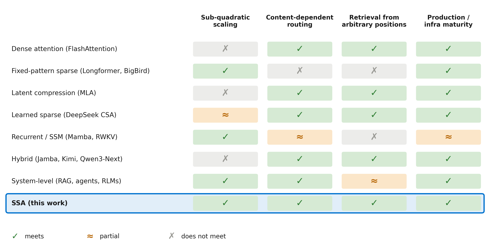

> **圖 4：** 長上下文權衡。每行是一個方法家族；每列是完整解決方案必須提供的四個屬性之一。每個先前的家族至少留下一列未滿足或僅部分滿足——這一反覆出現的模式激發了本工作。SSA 同時針對全部四個。

我們不知道有廣泛部署的架構同時提供全部四點。SSA 是我們對該組合的嘗試，SubQ-1.1-Small 是它產生的模型。

---

## 3. 方法（Methods）

我們沒有從頭訓練一個新模型，而是通過將其密集注意力替換為次平方稀疏注意力（SSA）來轉換一個現有的開源權重前沿模型。然後通過分階段的上下文擴展、大規模持續預訓練和針對性的後訓練來發展長上下文能力。本節描述了激發 SSA 的需求、用於發展長上下文能力的訓練過程，以及多百萬 token 規模實驗所需的基礎設施。

### 3.1 次平方稀疏注意力（SSA）

SSA 旨在同時滿足三個需求——如背景部分所述，這一組合是現有方法在實用長上下文系統中尚未實現的。SSA 滿足這些需求的機制超出了本報告的範圍；這裡我們專注於需求本身，因為它們激發了架構和隨後的實驗活動。

- **需求 1：密集注意力級別的檢索和推理品質。** 第一個需求是保留使密集注意力 [36] 有效的檢索和推理行為。許多高效序列模型實現了良好的縮放，但隨著上下文增長而降低檢索和推理能力——這正是我們關心的制度。因此，設計目標不是效率本身，而是來自任意位置的**密集注意力般的檢索**，這要求路由是**內容相關的**，由 token 本身決定而非固定位置模式 [2; 39]。

- **需求 2：次平方縮放。** 密集注意力隨序列長度呈二次方增長——這一成本使多百萬 token 的訓練和評估變得昂貴。第二個需求是一種成本增長更慢的機制，同時仍滿足需求 1。SSA 是稀疏的——每個查詢關注一小部分選定位置——其選擇、檢索和注意力步驟各自在序列長度上都是線性的，因此該機制是端到端線性的，而非僅在注意力操作內部。

- **需求 3：全上下文訓練和自回歸生成。** 模型需要在訓練期間對整個可用上下文進行優化，同時在推理時保留標準的序列自回歸解碼。狀態空間和遞歸架構如 Mamba [13] 和 RetNet [34] 通過壓縮狀態表示實現良好縮放，但訓練決策是通過該狀態中介的，而非對上下文中任意位置的直接訪問。相反，非自回歸方法可以全域優化，但偏離了當代語言模型推理和工具使用所基於的生成範式。第三個需求因此是同時保留兩者：訓練期間的全上下文優化和推理期間的高效逐 token 生成。

本節其餘部分描述了這些能力使之成為可能的內容。

### 3.2 實驗設計

SubQ-1.1-Small 並非來自單次訓練運行。在開發過程中，我們在模型的六個主要代際中進行了超過一百次長上下文實驗，探索了上下文擴展計劃、持續預訓練混合物、以檢索為重點的後訓練目標、能力保留技術和評估方法論。除了稍後報告的正式基準外，我們還維護了一套固定的面向部署的評估，涵蓋倉庫級程式碼推理、多文檔綜合、合約分析和工程文檔檢索，以便進展是針對現實的完整工件任務而非僅合成探針來衡量的。

這種實驗規模之所以可能，是因為 SSA 使多百萬 token 的訓練變得實用。在密集注意力下，每次長上下文實驗都會產生二次方增加的計算成本，限制了在長上下文行為出現的上下文長度上可以測試的假設數量。SSA 將這一約束降低到足以使多百萬 token 上下文上的迭代保持在每步一分鐘以內，使我們能夠在大規模上比較預訓練混合物、上下文擴展計劃、恢復技術和後訓練組合的變體。由此產生的實驗吞吐量增加使本工作中報告的大規模實證研究成為可能。

### 3.3 上下文擴展和持續預訓練

長上下文持續預訓練（CPT）是發展長上下文能力的主要機制。訓練強調自然長格式數據，包括書籍、長文檔和倉庫級程式碼，以暴露模型於真正的長程依賴。支持這需要逐步擴展模型的上下文窗口。捐贈模型支持 262K token 上下文。我們使用 YaRN [29] 在上下文長度增加時重新縮放位置表示，並分階段擴展模型：262K → 512K → 1M → 2M（圖 5）。長上下文 CPT 在擴展階段之間執行，而非直接擴展到最終目標長度。

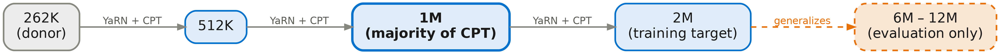

> **圖 5：** 帶持續預訓練的分階段上下文窗口擴展。捐贈模型從 262K token 上下文窗口開始。YaRN 位置縮放在每個階段（262K、512K、1M 和 2M）重新應用，長上下文持續預訓練在擴展之間執行。大多數 CPT token 在 1M 階段訓練，隨後在 2M tokens 處進行最終擴展和訓練階段。

訓練混合物將自然長序列與使用文檔分隔符打包到目標上下文長度的較短文檔結合。類似於 UltraLong [37] 和 DeepSeek-V3 [8]，我們在打包期間**沒有**遮罩跨文檔注意力邊界。因此，模型關注整個打包序列，包括分隔符 token，而非將文檔視為隔離的片段。

大多數 CPT token 在 1M token 上下文中訓練。為了研究長上下文能力如何發展，我們在模型代際之間改變 CPT 量和上下文長度，同時在多個上下文長度上評估檢索。

### 3.4 後訓練和能力平衡

長上下文持續預訓練主要負責發展長上下文能力。後訓練扮演不同的角色：**塑造該能力的表達方式**，同時保留和增強推理、編碼和指令遵循能力。

一個核心挑戰是**能力平衡**。檢索的改進並不總是可靠地轉移到其他能力，加強長上下文行為的訓練選擇可能轉移指令遵循、推理、檢索和知識密集型性能之間的平衡。因此，後訓練被設計為同時優化多個能力，而非孤立地優化檢索。

為了減少序列長度對優化的影響，我們探索了**樣本級損失聚合**（sample-level loss aggregation），它在樣本級別而非跨所有 token 對交叉熵進行平均。這減少了少數極長樣本主導訓練期間梯度更新的程度。

後訓練語料庫結合了合成檢索任務、長上下文推理數據、以編碼為導向的示例、教育材料和通用指令遵循數據。訓練是分階段和迭代的：針對性階段引入或加強特定能力，隨後是旨在保持跨更廣泛能力套件性能的恢復階段。混合物組成、損失公式和評估節奏在整個開發過程中共同調整，而非被視為獨立的設計選擇。

### 3.5 實驗基礎設施

在多百萬 token 序列上訓練既是計算問題也是記憶體問題。線性成本的注意力移除了二次方注意力計算，但激活、優化器狀態和每個樣例的原始長度仍必須適應可用記憶體預算。典型的長上下文運行每節點使用大約一百萬到兩百萬 tokens 的批次，並且在整個開發過程中使用的訓練長度上，迭代保持在每步一分鐘以內。這使多百萬 token 上下文上的大規模實驗變得實用而非例外。

記憶體預算是通過**逐步升級**來管理的，每個上下文長度階段僅使用該階段所需的並行和卸載技術組合（圖 6）。訓練不是從一開始就採用最昂貴的分佈式配置，而是隨著上下文長度增加沿著記憶體縮放階梯上升：從單節點到節點內序列並行，到 CPU 卸載，最終到最長上下文的多節點執行。這使大部分開發能夠以支持目標上下文長度的最簡單配置運行，同時為後期階段保留更昂貴的策略。

> **圖 6：** 開發期間使用的記憶體縮放階梯。隨著上下文長度增加，訓練從單節點配置逐步升級到序列並行、CPU 卸載、多節點序列並行、嵌套卸載，最後是 Ring Attention。大多數實驗在能夠支持目標上下文長度的最低梯級上運行，在保持快速迭代的同時最小化系統複雜性。

基礎是混合分片數據並行 [41]，它在節點內分片參數和優化器狀態，同時跨節點複製。序列並行 [15] 將每個長樣例分片到節點的 GPU 上，而帶 CPU 卸載的 ZeRO 風格分區 [31] 在必要時將優化器狀態和激活移出設備。

隨著上下文長度超過 2M tokens，堆疊的其他層被啟用，包括多節點序列並行、嵌套 CPU 卸載和用於跨節點分佈單個樣例的 Ring Attention [23]。這些技術各自已成熟，但沒有一項開箱即用能與 SSA 高效運行。每項都需要適應以容納 SSA 的內容相關選擇和檢索操作，這些操作引入了標準密集注意力中不存在的記憶體訪問模式和同步需求。由此產生的系統實現了常規的多百萬 token 訓練，同時保留了使更廣泛實驗研究成為可能的快速迭代速率。

---

## 4. 結果（Results）

我們在六個維度上評估 SubQ-1.1-Small：長上下文檢索、上下文長度泛化、知識、編碼、長時域代理任務和效率。核心結果是：主要在 100 萬 token 上下文中發展的檢索行為大幅泛化到訓練窗口之外，在保留評估中延伸至 1200 萬 tokens。然後我們評估這種能力是否轉移到現實的多步驟任務，是否保留了捐贈模型的更廣泛推理和編碼能力，以及 SSA 是否足夠高效以使這些規模的實驗變得實用。

### 4.1 長上下文檢索

**RULER** [14] 是由 NVIDIA 開發的 13 項任務長上下文評估套件，用於衡量超越單一事實查找的檢索能力。其任務涵蓋四個軸：單鍵檢索；多鍵檢索（從上下文中定位並返回多個獨立事實）；常見詞和頻繁詞提取（在整個上下文上聚合分佈統計，而非檢索單個段落）；以及多跳變數追蹤（答案需要鏈接跨位置的證據，每個位置單獨不足）。這種廣度是我們將 RULER 視為主要檢索基準的原因：頻率提取和多跳追蹤特別考驗廣泛的注意力覆蓋和跨位置組合，這是單一事實基準無法做到的。一個完美檢索個別事實但無法跨位置聚合或組合的模型將在單鍵任務上得分很高，但在這些任務上失敗。

我們在 **128K tokens** 上報告 RULER——原始套件中最長的標準化評估長度。SubQ-1.1-Small 在完整的 13 項任務平均中達到 **99.12%**。在以檢索為導向的任務上性能實際上飽和，剩餘錯誤集中在聚合風格任務上，如常見詞和頻繁詞提取，這些任務的成功取決於上下文的廣泛覆蓋而非特定目標的檢索。

**Needle-in-a-Haystack（NIAH）** 將單個可檢索語句（如 UUID 鍵控段落）放置在受控深度的無關自然語言文本長上下文中，然後提示模型定位並精確返回它。我們使用 NIAH 作為上下文長度泛化的受控探針：因為每個樣本恰好有一個目標和定義明確的正確答案，它產生一個乾淨的二元信號，在更複雜的多任務評估變得昂貴的長度上可以明確評分。我們在 1M 和 2M tokens（訓練窗口內）以及 6M 和 12M tokens（保留）上進行評估。保留評估包括 50 個單針 UUID 樣本，以 niah_single_1 任務的風格打包到大約 12M tokens。數據集已準備好供第三方驗證。

SubQ-1.1-Small 在 1M 和 2M 達到 **100%**，在 6M 和 12M 達到 **98%**（圖 7）。在 12M tokens 處，模型僅關注 **0.13%** 的 token 對。

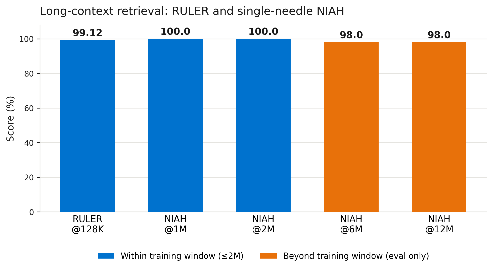

> **圖 7：** SubQ-1.1-Small 長上下文檢索。單針 NIAH 準確率在 1M、2M、6M 和 12M tokens 處均完美（100%）；128K 的 RULER 接近飽和，達 99.12%。

### 4.2 知識能力

一個檢索精確但對所檢索內容推理不佳的長上下文模型不能解決完整工件任務。合約分析需要理解法律定義，而不僅僅是定位它們；倉庫級程式碼推理需要理解控制流，而不僅僅是找到相關函數。因此，知識能力——將事實理解和多步驟推理應用於特定領域問題的能力——不是次要軸。它是上述檢索能力轉化為有用下游行為的先決條件。

這也是長上下文訓練產生風險的地方。我們執行的持續預訓練可能取代捐贈模型原始訓練期間獲得的知識和推理行為。我們活動中的早期檢查點顯示出這種模式：檢索改進而知識密集型評估退化。第 3.4 節描述的能力平衡階段是對此的直接回應。

**GPQA Diamond** [32] 是一個研究生級別的科學基準，包含物理、化學和生物學的專家編寫問題，經驗證對非專家困難。領域博士達到約 65% 準確率，使其成為檢驗模型是否保留深層事實知識和多步驟科學推理的較嚴格測試之一。

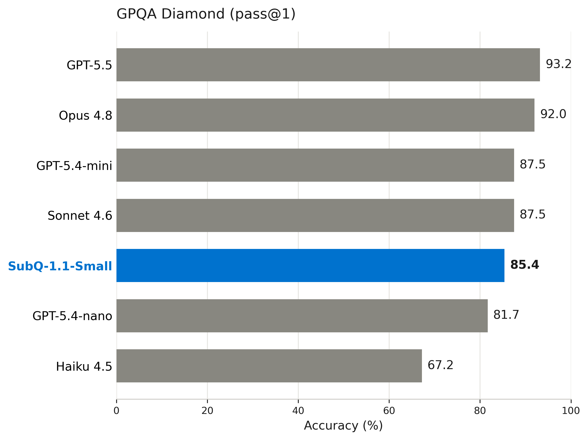

> **圖 8：** GPQA Diamond 上的知識能力（pass@1）。SubQ-1.1-Small（85.4%）位於中層前沿模型（Sonnet 4.6 和 GPT-5.4-mini 為 87.5%）之下，遠高於較小層級（GPT-5.4-nano 81.7%、Haiku 4.5 67.2%）。

SubQ-1.1-Small 達到 **85.4%** pass@1。SubQ-1.1-Small 位於小型和中型前沿層級之間，領先於最小的前沿模型並接近中型模型。意圖解釋不是在所有短上下文基準上達到最先進水平；而是一個針對長上下文行為優化的小模型也可以具有強大的知識和推理性能，這確認了長上下文優化**本質上不會以推理品質為代價**。結果反映了第 3.4 節描述的能力平衡階段的有效性。

### 4.3 編碼能力

長上下文模型在編碼中有許多應用。規劃、審查和長時域記憶與連貫性可能是當今編碼空間中最高價值的機會。我們認為 SubQ-1.1-Small 將被用於更廣泛編碼系統中的這些專業但關鍵的任務，而非通用的代理編程。

**LiveCodeBench** [16] 是一個持續更新的競賽程式設計基準，從 LeetCode、Codeforces 和 AtCoder 等平台抽取問題。問題在模型訓練截止日期之後發布，限制了記憶並測試真正的算法推理。我們評估 LiveCodeBench v6 並按照原始 LiveCodeBench 論文中使用的評估方法報告 pass@4。

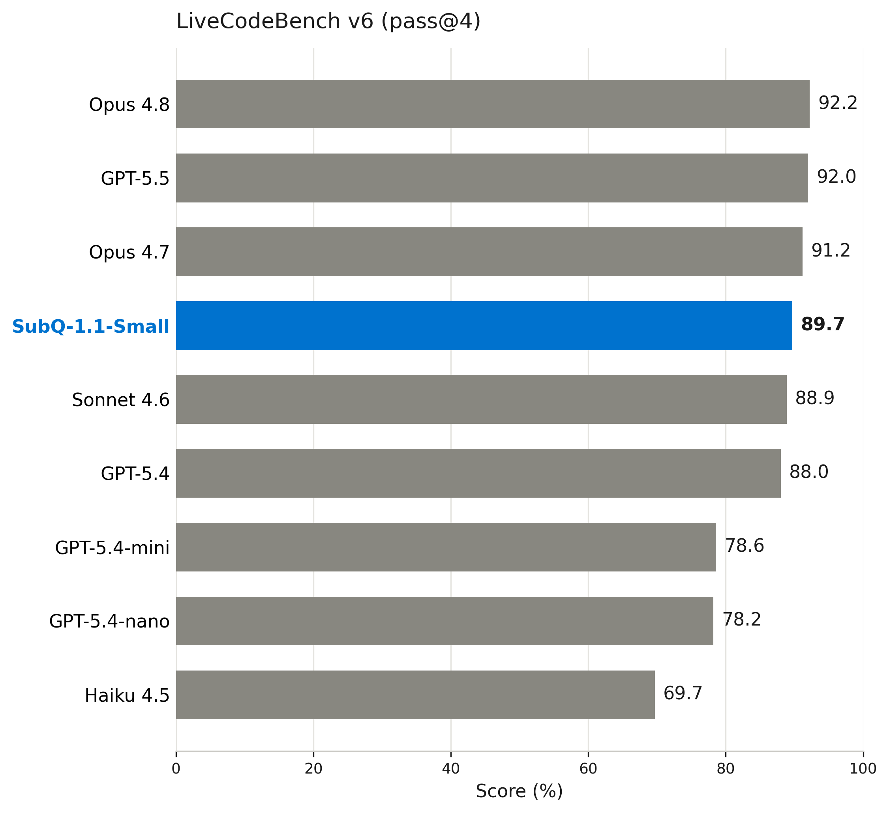

> **圖 9：** 編碼能力。SubQ-1.1-Small 在 LiveCodeBench（pass@4，原始論文協議）上達到 89.7%，確認編碼行為在長上下文優化後被重新引入。

SubQ-1.1-Small 達到 **89.7%** pass@4，確認我們的長上下文模型也可以在編碼任務上表現強勁。如第 5.3 節所討論，編碼數據在訓練期間也發揮了雙重作用：它改進了非代碼的長上下文檢索，可能是因為代碼密集地包含訓練通用路由行為的那種跨位置依賴。

### 4.4 長時域代理任務

前面各節的基準評估個別能力：檢索、知識和編碼。在部署中，這些能力必須協同工作。一個財務工作流可能要求代理讀取結構化申報和非結構化通信，跨多個業務應用程式發現可用的 API 端點，應用組織政策，並產生其正確性取決於跨許多先前步驟收集的證據的行動。錯誤跨步驟累積，代理必須在整個過程中保持連貫狀態。

**AutomationBench** [33] 精確評估這種設置。它向代理呈現需要跨互聯應用程式（CRM、電子郵件、日曆、試算表、消息平台）通過 REST API 協調行動的自然語言業務任務。代理必須從大約 47 個應用程式中可用的約 500 個端點中自主發現正確的端點，進行序列化和相互依賴的 API 調用，並遵守從政策文檔中提取的分層業務規則。環境中播種了無關和誤導性記錄，因此代理必須在步驟間區分相關上下文和噪音。評分是二元的最終狀態正確性——正確的數據是否到達了正確的系統——沒有部分分數。我們評估 Finance 垂直領域，它將這種結構應用於以財務為導向的工作流，因為它測試長上下文能力是否轉化為現實條件下持續的多步驟推理。結果將 SubQ-1.1-Small 置於最強對比模型附近，並領先於較小的前沿基線：

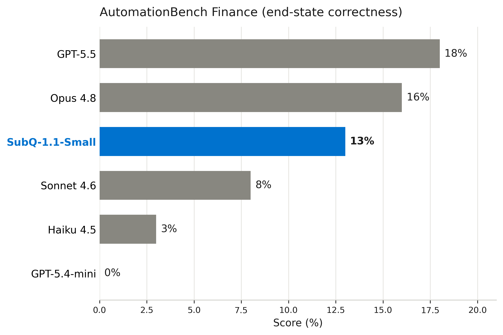

> **圖 10：** 長時域代理財務任務上的 AutomationBench Finance 分數。SubQ-1.1-Small（13%）接近絕對前沿（Opus 4.8 16%、GPT-5.5 18.0%），領先於 Anthropic 和 OpenAI 的中型和小型模型（Sonnet 4.6 8%、Haiku 4.5 3%、GPT-5.4-Mini 0.0%）。

### 4.5 效率

效率測量在 B200 上評估一個注意力層，對比同一骨幹上的密集基線。此處顯示的設置極為保守。鑑於我們的時間限制，我們尚未消融稀疏性能有多積極，而是設定了我們認為在任何設置中都極其安全的值，這在最高 12M tokens 處被證明是正確的。重點不是最大化稀疏性，而是最大化上下文長度。然而，未來工作將包括比今天高出許多倍的稀疏性建模。有限的實驗以 4 倍的以下稀疏性成功完成，結果極為積極，下限可能更低。

| 上下文長度 | 密集注意力 (PFLOP) | SSA (PFLOP) | 減少倍數 |
|-----------|-------------------|------------|---------|
| 32K       | 0.25              | 0.12       | **2.1×** |
| 64K       | 0.99              | 0.25       | **4.0×** |
| 128K      | 3.9               | 0.49       | **8.0×** |
| 256K      | 15.8              | 0.99       | **16×**  |
| 512K      | 63.0              | 2.0        | **31.5×**|
| 1M        | 252               | 3.9        | **64.5×**|

> **表 1：** 一個注意力層每次前向傳播的注意力機制 FLOPs，SSA 對比每層使用密集注意力的同一骨幹。

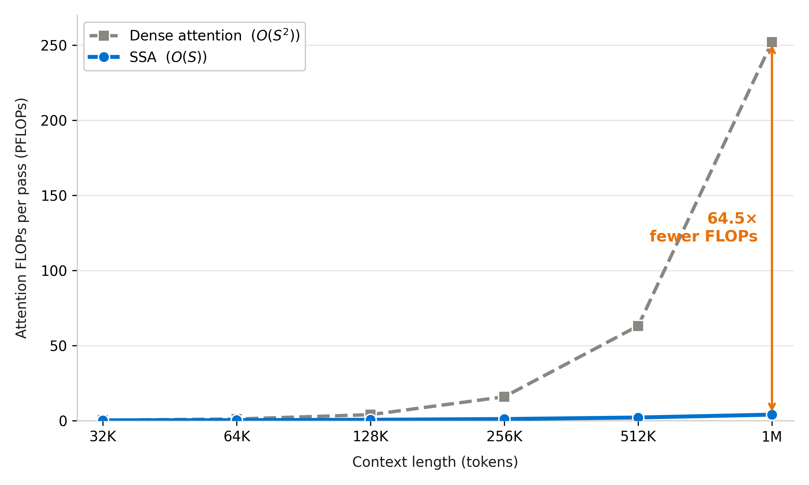

> **圖 11：** 單個 B200 上的 SSA 計算量。每次前向傳播的注意力機制 FLOPs：密集注意力呈二次方增長，而 SSA 呈線性增長——在 1M tokens 處減少 64 倍。

我們還在單個注意力層上隔離測量注意力機制對比 FlashAttention-2。這將 SSA 的縮放行為與 MLP、歸一化和其他模型級成本隔離開來。

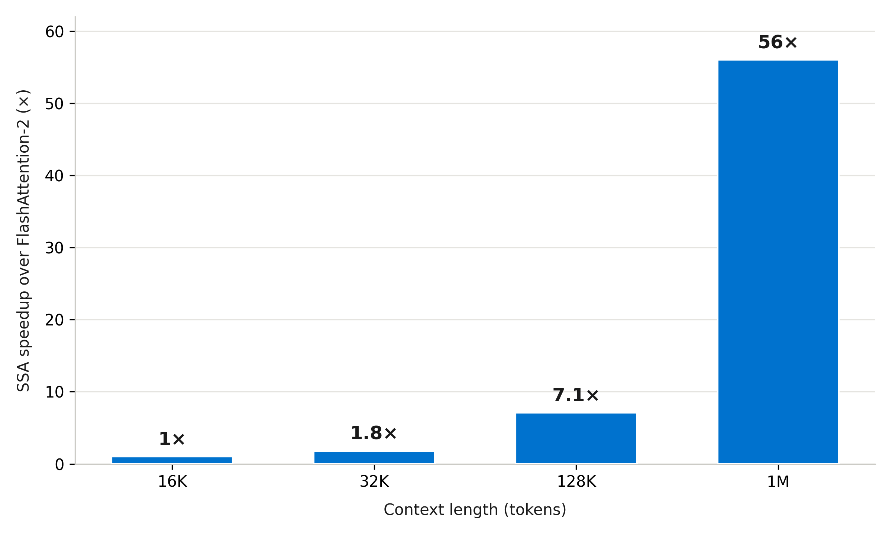

> **圖 12：** 單注意力層 SSA 對 FlashAttention-2 的加速比。SSA 在大約 16K tokens 處達到平價，並隨著上下文增長拉開距離，在 1M tokens 處達到 56 倍——SSA 運行 966 毫秒，而 FlashAttention-2 為 54,164 毫秒。在 H100 上測量。

兩項測量顯示相同的形狀：SSA 相對於密集注意力的優勢不是均勻的常數因子加速，而是一個**縮放法則勝利**——隨著序列長度增長變得更有價值。

---

## 5. 討論（Discussion）

### 5.1 上下文長度泛化

本報告的核心長上下文結果不是任何單一長度的分數。而是算法在極高稀疏性和線性縮放下保留檢索準確率，並將檢索泛化到模型訓練長度之外的能力。SubQ-1.1-Small 的長上下文持續預訓練絕大多數在 1M tokens 上進行，小部分在 2M 上進行，沒有超出此範圍。我們在最高 **12M tokens** 上評估單針檢索——最大訓練長度的六倍，主要訓練窗口的大約十二倍。

**單針檢索強烈泛化。** 在每個長度 50 個保留的 UUID NIAH 樣本上，SubQ-1.1-Small 在 1M 和 2M 達到 100% 召回率，在 **6M 和 12M 均達到 98%**。這不是訓練運行的設計目標；它在長上下文 CPT 後浮現。此前，我們通過多百萬 token SFT 實現了此結果，但長上下文 CPT 的初始運行使模型能夠以更少的超長上下文 SFT 泛化此結果。在 12M tokens 處，SSA 僅關注注意力層中 token 的 **0.13%**，使此評估在無需額外壓縮的情況下變得實用。

我們認為這種行為與 SSA 的**內容相關路由**一致。因為檢索由內容相關性而非固定位置模式驅動，該機制可能不會在相關路由行為被學習後施加明顯的上下文長度邊界。

### 5.2 高效注意力作為研究加速器

密集長上下文活動昂貴到大多數團隊只能獲得少量嘗試。在 SSA 下，我們運行了超過一百次。實驗吞吐量的差異——而非推理加速——產生了以下發現。因果鏈是具體的：SSA 的線性成本不僅使長上下文實驗在經濟上可行，而且實現了更快、更深入的迭代。

迭代在百萬級 token 上下文中保持在每步一分鐘以內，這足以運行跨 CPT 混合物、上下文擴展計劃、能力平衡技術和後訓練組合的重複變體，並且是在長上下文行為實際出現的上下文長度上進行。

本討論中的觀察是從高變體數量制度中浮現的那種：每個觀察之所以可見，僅僅因為我們能夠負擔浮現它的變體——許多 CPT 量設置、跨許多長度和檢查點的 NIAH 評估、比典型管道產生的更多檢查點。團隊能運行的變體越多，結果就越有信心歸因於特定變化，能力變得響應迭代速度而非僅原始規模。

如果長上下文能力受限於實驗吞吐量而非原始規模，那麼**算法效率**成為一級縮放變量，與模型大小和數據集大小相當。在我們看來，這個軸上的前沿尚未被充分探索。

### 5.3 長上下文預訓練作為解鎖

在 SubQ-1.1-Small 背後的實驗中，**長上下文 CPT 量**是長上下文檢索收益最一致的預測因子。我們對如何強烈解讀此點保持謹慎。我們尚未運行受控消融，在其中相同的 CPT 配方與架構上不同的骨幹配對，因此我們不能排除不同架構會對相同訓練制度做出不同反應。我們在長上下文推理和檢索的強化學習實驗方面也處於早期階段。我們自信持有的發現版本是較弱的：在我們運行的實驗集內，長上下文 CPT 是最一致的杠杆。在我們的運行中，我們嘗試的後訓練變體不能替代持續預訓練期間對長上下文的曝光，且我們的長上下文後訓練從更多的長上下文預訓練中顯著受益。

### 5.4 平衡短上下文和長上下文能力

SubQ-1.1-Small 開發過程中反覆出現的模式是短上下文和長上下文能力必須保持多麼緊密的平衡：長上下文能力的收益經常以短上下文能力為代價，除非訓練為兩者管理。在其他時候，長上下文和短上下文訓練是互補的——長上下文訓練運行可以改進模型在短上下文任務上的表現，反之亦然。研究哪些能力最敏感、哪些最互補、哪些數據最有效地同時加強兩者，是我們工作的關鍵部分。

### 5.5 評估和測量

基準分數和部署形態行為的分歧超出了我們的預期，這種差距改變了我們選擇檢查點的方式。最清晰的案例是 **MRCR v2**。早期 SubQ-1.1-Small 檢查點在 MRCR 上得分很高，我們最初將其視為一個重要的長上下文信號。然而，隨著開發的進展，MRCR 的變動偏離了我們試圖改進的行為：倉庫級程式碼推理、多文檔綜合和合約風格分析。在 MRCR 上看起來最好的檢查點在這些任務上不一定表現最好。

我們通過早期工作流測試和與正式基準並行維護的固定定性抽查集來識別這種差距。第一個信號是定性的：MRCR 優化的檢查點在使用中通常感覺更差，即使基準朝正確方向移動。為了使該信號不那麼軼事化，我們通過涵蓋倉庫級程式碼推理、多文檔綜合以及針對真實合約和工程文檔語料庫的檢索的固定抽查來追蹤它。這些不是標準化的基準結果，我們不以基準報告它們。它們是開發診斷，由團隊成員根據一致的評分標準評分，用於測試檢查點是否在用戶實際嘗試運行的工作流上改進。

這種權衡在檢查點選擇期間出現。推高 MRCR 並不總是使模型在我們關心的任務上變得更好，在某些運行中它使模型在固定抽查上變得更差。

**RULER** 成為更有用的開發信號。RULER 上的改進和退化更經常追蹤定性抽查。我們的解釋是 RULER 的多任務結構更好地與完整工件推理重疊：聚合、組合、干擾下的檢索和多跳推理。

### 5.6 DeepSeek 稀疏注意力與選擇成本

DeepSeek 最近的長上下文系統是 SSA 最接近的已發表比較點。DeepSeek 動態稀疏注意力線（包括 DeepSeek V3.2 和 DeepSeek V4）的主要架構創新是 **Lightning Indexer**：一個學習的機制，動態選擇每個查詢應關注哪些上下文位置（DeepSeek-AI 2025, 2026）。這正是 SSA 旨在解決的相同問題。重要的區別在於**選擇的成本在哪裡支付**。

我們著手解決此問題，而不重新引入 DeepSeek Lightning Indexer 的二次方縮放法則，以創造超越標量的收益。

有三個相關的機制值得分開。**DeepSeek Sparse Attention（DSA）** 是動態稀疏注意力機制本身：Lightning Indexer——一個從教師模型蒸餾的完全注意力模型——對查詢-鍵對進行評分，並選擇下游稀疏注意力應在較大的教師模型中讀取哪些位置。**CSA** 使用相同的選擇理念，但在上下文的壓縮表示上運行 Lightning Indexer。換句話說，DSA 和 CSA 執行相同類型的學習動態選擇，它們主要區別在於在其上執行選擇的表示。**HCA** 不同：它不執行學習選擇。它積極壓縮上下文，然後在該壓縮表示上應用暴力密集注意力。

SSA 直接針對 DSA 和 CSA 中 Lightning Indexer 扮演的選擇角色。概念上，SSA 可以在任一設置中替換選擇器：在未壓縮表示上（如 DSA），或在壓縮表示上（如 CSA）。HCA 風格的壓縮本質上也並非與 SSA 不相容。我們對 SSA 與重度壓縮表示結合進行了有限探索，但我們尚未在模型上穩健驗證 SSA 對這些表示執行的選擇。我們將該組合視為未來工作。

在 DSA 中，索引器僅在短上下文處比它服務的注意力便宜。在 DeepSeek v3.2 中，超過約 52,000 tokens 的交叉點後，其二次方評分超過教師模型中線性複雜度的稀疏注意力，在 1M tokens 處達到教師注意力成本的大約 16.1 倍，在 12M tokens 處達到 190.4 倍。一個旨在使長上下文可負擔的路由機制成為主導的長上下文成本，在提供標量計算節省後重新引入二次方縮放。

| 序列長度 | Indexer FLOPs | Sparse Attn FLOPs | Indexer/Attn |
|---------|--------------|------------------|-------------|
| ≈52K    | 28.0T        | 28.0T            | 1.0× — 交叉點 |
| 128K    | 156.4T       | 71.0T            | 2.2×        |
| 256K    | 594.2T       | 142.1T           | 4.2×        |
| 512K    | 2.31P        | 284.2T           | 8.1×        |
| 1M      | 9.13P        | 568.3T           | 16.1×       |
| 2M      | 36.3P        | 1.14P            | 31.9×       |
| 4M      | 144.6P       | 2.27P            | 63.6×       |
| 8M      | 577.5P       | 4.55P            | 127.0×      |
| 12M     | 1,298.5P     | 6.82P            | 190.4×      |

> **表 2：** V3.2 風格 DSA 配置的主注意力（固定 top-k 選擇）對比 Lightning Indexer 每層 FLOPs。主注意力讀取已發布配置的固定 2,048 個選定 token，在序列長度上是線性的；索引器評分所有對，是二次方的。T = 10¹²，P = 10¹⁵ FLOPs。

SSA 的選擇器明顯更便宜。下表比較在匹配的選定位置預算下每層預填充 FLOPs：

| 序列長度 | DSA 層 FLOPs | SSA 層 FLOPs | DSA/SSA |
|---------|-------------|-------------|---------|
| 128K    | 227.4T      | 71.0T       | 3.2×    |
| 256K    | 736.3T      | 142.1T      | 5.2×    |
| 512K    | 2.60P       | 284.2T      | 9.1×    |
| 1M      | 9.70P       | 568.3T      | 17.1×   |
| 2M      | 37.4P       | 1.14P       | 32.9×   |
| 4M      | 146.9P      | 2.27P       | 64.6×   |
| 8M      | 582.0P      | 4.55P       | 128.0×  |
| 12M     | 1,305.4P    | 6.82P       | 191.3×  |

> **表 3：** 匹配選定位置預算下 DSA 對比 SSA 的每層預填充 FLOPs。DSA 包含 Lightning Indexer 評分。

### 5.7 對長上下文應用的啟示

本節迄今為止的討論是關於模型開發。其餘部分是關於部署。

我們認為，長上下文模型最重要的企業啟示不是更大的上下文窗口本身。而是**直接對完整或更完整的工件進行推理**的能力，並創建避免 RAG 和代理系統中通過策劃帶來的許多權衡的更可泛化系統。今天的許多企業 AI 系統依賴精心策劃和限定範圍的檢索、重新排序、分塊和編排基礎設施來重建底層數據中已存在的上下文，在此過程中引入脆弱性和累積錯誤。隨著長上下文能力的改進，當前重建上下文所需的一些檢索、重新排序和編排邏輯可以**移入模型本身**。我們將這種從對檢索片段推理到直接對工件推理的轉變視為長上下文 AI 實現的最重要轉變之一，本節其餘部分將發展其在實踐中的含義。

#### 5.7.1 完整工件推理

這些結果的實際含義不僅僅是更大的窗口容納更多 tokens。而是某些當前實現為檢索問題的任務，一旦相關工件適合放入上下文，就更自然地是**完整工件推理問題**。在許多實際系統中，檢索和分塊被使用不是因為任務本身可分解，而是因為相關工件無法放入上下文。隨著可達到的上下文長度增長，一些分解階段變得不必要，而非僅僅更容易實現。

這種結構跨領域反覆出現：法律工作需要跨合約的交叉引用解決，財務審查需要連接申報和內部記錄，研究需要跨有界文獻的綜合。在每種情況下，困難不在於定位段落；而在於對分佈在工件中的關係進行推理。**碎片化系統地破壞了這些關係**，在模型有機會看到它們之前。將整個工件保留在上下文中改變了任務的形狀，而不僅僅是其速度。

在許多情況下，即使簡單地增加檢索塊的數量、增加塊的大小、或增加並發檢索步驟的數量都可以改進系統，而即使在現有窗口內獲得更高智能、更便宜、更快的上下文訪問也將實現這種轉變。

其含義不是檢索已過時。對於大於任何合理上下文窗口的語料庫、變化速度快於提示可更新的知識，以及具有真正多階段結構的工作流，檢索和編排仍然是正確的工具。較狹窄的主張是：某些支架主要存在是為了彌補上下文限制。隨著高效長上下文模型擴展可達到的窗口，這類支架變得更小。對於其困難來自分佈在有界工件中的關係的任務，**保留工件不是實現細節；它是能力的一部分**。

---

## 6. 結論（Conclusion）

我們提出了 **SubQ-1.1-Small**，一個建立在**次平方稀疏注意力（SSA）**上的長上下文語言模型——一種具有線性計算和記憶體複雜度的內容相關注意力機制。SSA 在 1M token 上下文窗口下將注意力 FLOPs 降低 **64.5 倍**，使多百萬 token 的訓練和評估變得足夠實用，能夠在相關行為出現的上下文長度上運行超過一百次長上下文實驗。因此，SSA 的價值不僅在於使長上下文推理更便宜，更在於使**長上下文實驗更便宜**。

該實驗制度產生了本工作的核心實證結果：**長上下文檢索遠遠泛化到訓練期間使用的窗口之外**。SubQ-1.1-Small 主要在 1M tokens 上訓練，並在 2M 上進行額外訓練，然而單針檢索在 6M 和 12M 均保持在 **98%**。在我們的實驗中，長上下文能力不表現為對固定上下文長度的專門化。它表現為一種通過曝光於長上下文而學習的能力，長上下文持續預訓練作為我們發現的最強杠杆浮現。

相同的訓練制度也產生了檢索之外的證據。在 AutomationBench Finance 上，SubQ-1.1-Small 達到 **13%**，接近 Opus 4.8，並在相同設置下大幅超越 Sonnet 4.6 和 Haiku 4.5——這是長上下文訓練制度轉移到長時域代理推理的早期證據。

更廣泛的啟示是：高效注意力改變了開發循環。如果長上下文實驗的成本太高，團隊被迫猜測配方。如果成本降得足夠低，他們可以**搜索**它。在我們的情況下，該搜索與架構本身同等重要：它揭示了長上下文持續預訓練、能力平衡、編碼數據和評估選擇的重要性，這些從少量運行中難以發現。

這一進展的重點不是為了自身而追求更長的上下文窗口。而是要訓練能夠**直接對完整工件進行推理**的模型：倉庫、文件集合、知識庫和長時間運行的工作流。能夠很好地做到這一點的模型應該使許多當前系統變得更簡單：更少的分塊、更少的檢索支架、更少的編排來彌補缺失的上下文。目標是更快、更便宜、更強大的模型，其智能應用於**工件本身**，而非圍繞上下文限制重建的片段。

---

## 參考文獻

[1] Simran Arora, et al. *Zoology: Measuring and improving recall in efficient language models*. ICLR, 2024.  
[2] Iz Beltagy, et al. *Longformer: The long-document transformer*. arXiv:2004.05150, 2020.  
[3] Rewon Child, et al. *Generating long sequences with sparse transformers*. arXiv:1904.10509, 2019.  
[4] Gonçalo M. Correia, et al. *Adaptively sparse transformers*. EMNLP-IJCNLP, 2019.  
[5] Tri Dao. *FlashAttention-2: Faster attention with better parallelism and work partitioning*. arXiv:2307.08691, 2023.  
[6] Tri Dao and Albert Gu. *Transformers are SSMs*. ICML, 2024.  
[7] Tri Dao, et al. *FlashAttention: Fast and memory-efficient exact attention with IO-awareness*. NeurIPS, 2022.  
[8] DeepSeek-AI. *DeepSeek-V3 technical report*. arXiv:2412.19437, 2024.  
[9] DeepSeek-AI. *Deepseek-V2: A strong, economical, and efficient mixture-of-experts language model*. arXiv:2405.04434, 2024.  
[10] DeepSeek-AI. *Native sparse attention*. arXiv:2502.11089, 2025.  
[11] DeepSeek-AI. *DeepSeek-V4-Flash model card*. HuggingFace, 2026.  
[12] Gemma Team, Google DeepMind. *Gemma 4 technical report*. 2026.  
[13] Albert Gu and Tri Dao. *Mamba: Linear-time sequence modeling with selective state spaces*. arXiv:2312.00752, 2023.  
[14] Cheng-Ping Hsieh, et al. *RULER: What's the real context size of your long-context language models?* arXiv:2404.06654, 2024.  
[15] Sam Ade Jacobs, et al. *DeepSpeed Ulysses*. arXiv:2309.14509, 2023.  
[16] Naman Jain, et al. *LiveCodeBench*. arXiv:2403.07974, 2024.  
[17] Samy Jelassi, et al. *Repeat after me: Transformers are better than state space models at copying*. ICML, 2024.  
[18] Angelos Katharopoulos, et al. *Transformers are RNNs: Fast autoregressive transformers with linear attention*. ICML, 2020.  
[19] Kimi Team. *Kimi linear: An expressive, efficient attention architecture*. arXiv:2510.26692, 2025.  
[20] Aakash Lahoti, et al. *Mamba-3: Improved sequence modeling using state space principles*. arXiv:2603.15569, 2026.  
[21] Patrick Lewis, et al. *Retrieval-augmented generation for knowledge-intensive NLP tasks*. NeurIPS, 2020.  
[22] Opher Lieber, et al. *Jamba: A hybrid transformer-mamba language model*. arXiv:2403.19887, 2024.  
[23] Hao Liu, et al. *Ring attention with blockwise transformers for near-infinite context*. arXiv:2310.01889, 2023.  
[24] MiniMax. *Why did MiniMax-M2 end up as a full attention model?* Engineering Blog, 2025.  
[25] MiniMax. *MiniMax-M1: Scaling lightning attention to 128k sequences*. 2025.  
[26] MiniMax. *The MiniMax-M2 series*. arXiv:2605.26494, 2026.  
[27] NVIDIA. *NVIDIA Nemotron 3 family of models*. 2025.  
[28] Bo Peng, et al. *RWKV: Reinventing RNNs for the transformer era*. arXiv:2305.13048, 2023.  
[29] Bowen Peng, et al. *YaRN: Efficient context window extension of large language models*. arXiv:2309.00071, 2023.  
[30] Qwen Team, Alibaba. *Qwen3-next technical report*. 2026.  
[31] Samyam Rajbhandari, et al. *ZeRO: Memory optimizations toward training trillion parameter models*. arXiv:1910.02054, 2020.  
[32] David Rein, et al. *GPQA: A graduate-level google-proof Q&A benchmark*. arXiv:2311.12022, 2023.  
[33] Daniel Shepard and Robin Salimans. *AutomationBench*. arXiv:2604.18934, 2026.  
[34] Yutao Sun, et al. *Retentive network: A successor to transformer for large language models*. arXiv:2307.08621, 2023.  
[35] Richard S. Sutton. *The bitter lesson*. 2019.  
[36] Ashish Vaswani, et al. *Attention is all you need*. NeurIPS, 2017.  
[37] Chejian Xu, et al. *From 128K to 4M: Efficient training of ultra-long context large language models*. arXiv:2504.06214, 2025.  
[38] Songlin Yang, et al. *Gated delta networks: Improving Mamba2 with delta rule*. ICLR, 2025.  
[39] Manzil Zaheer, et al. *Big bird: Transformers for longer sequences*. NeurIPS, 2020.  
[40] Alex L. Zhang, et al. *Recursive language models*. arXiv:2512.24601, 2025.  
[41] Yanli Zhao, et al. *PyTorch FSDP: Experiences on scaling fully sharded data parallel*. arXiv:2304.11277, 2023.

---

> **翻譯完成。** 原始 PDF 及各頁渲染圖片存放於 `figures/` 目錄。如有翻譯錯誤或需要補充內容，歡迎提交 Issue/PR。
